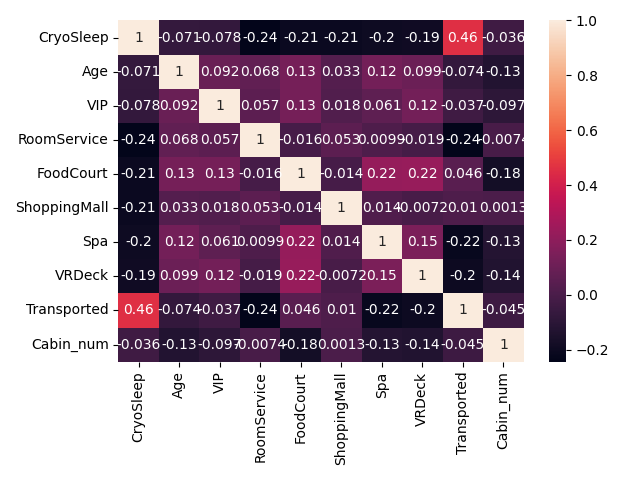
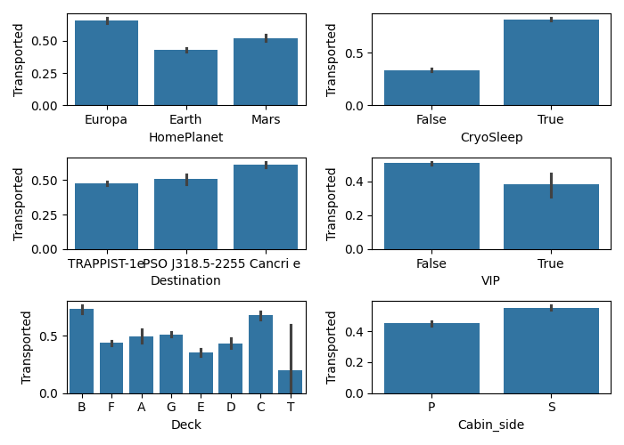
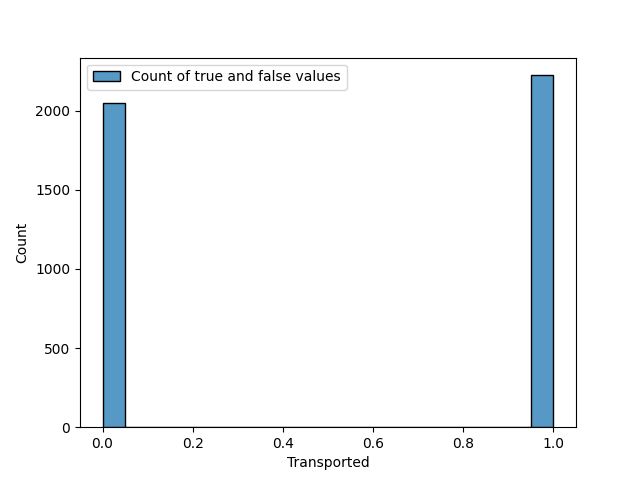

# Titanic Spaceship with Logistic Regression

This is a getting-started project. 

This notebook features a typical data science process.

From data exploration to training a simple model, this notebook is for 'getting-started' purposes.

Some graphs generated; 

This graph shows correlations between numerical features in this dataset. No correlations are above 0.5, so it's safe to keep all features.

This graph informations about categorical features' contribution to the target label.

And this graph, shows how many passengers were predicted to be transported or not. 
